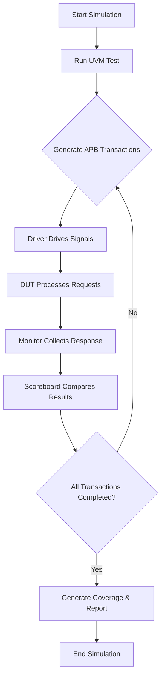

# UVM Verification of APB_RAM

## Overview
This project implements a comprehensive **UVM (Universal Verification Methodology)** environment to verify the functionality of an **APB_RAM** module. The APB_RAM module is a memory block interfaced with an **AMBA APB (Advanced Peripheral Bus)** protocol, supporting read and write operations with proper handshake and control signals.

---

## Project Description

The **APB_RAM** module serves as a synchronous memory block accessed through the APB protocol interface. It supports:
- Byte-addressable read/write operations
- Handshake signals including `PSEL`, `PENABLE`, and `PREADY`
- Error detection on protocol violations

The goal of this project is to develop a reusable, scalable UVM verification environment capable of thoroughly validating the APB_RAM design under multiple scenarios.

---

## Verification Environment Architecture

The verification environment is composed of the following components:

- **Agent**: Encapsulates Driver, Monitor, and Sequencer  
- **Driver**: Drives APB signals to the DUT according to sequences  
- **Monitor**: Observes DUT signals and collects transaction data  
- **Sequencer**: Generates sequences of APB transactions (read/write)  
- **Scoreboard**: Compares DUT outputs with expected results to ensure correctness  
- **Subscriber**: Functional coverage points to verify stimulus completeness
- **Env**: Encapsulates Agent, Agent_config, Scoreboard, and Subscriber  
 


---

## Agent Configuration and UVM Package

To facilitate ease of use and scalability, the environment employs an **`agent_config`** configuration class that centralizes agent parameters and settings. This approach allows easy modification of agent behavior without changing multiple files.

Additionally, all UVM related classes and components are bundled inside a dedicated **package file (`uvm_apb_ram_pkg.sv`)**, which contains all the necessary UVM classes (driver, monitor, sequencer, agent, environment, scoreboard, coverage models). This packaging promotes modularity, reusability, and clean integration in different projects.

---

## Features

- Fully parameterized UVM agent for APB protocol  
- Multiple test scenarios including random and directed sequences  
- Automated scoreboard checking  
- Functional coverage collection with coverage reports  
- Error injection tests for protocol compliance  
- Support for debug and waveform generation  

---
## 🚀 How to Run

1. **Compile** the RTL and testbench:
   ```bash
   vsim +access+r;
    run -all;
    acdb save;
    acdb report -db fcover.acdb -txt -o coverage_data.txt;
    exit
   ```
   

2. **Run Simulation**:
   [EDA Playground Link](https://www.edaplayground.com/x/skRk)

---

## Simulation Flow

Below is a simplified flow of the simulation and verification process:



*Figure 1: Simulation Flowchart*

---

## Coverage and Reporting

- Functional coverage points track all valid read/write operations and address ranges  
- Scoreboard reports mismatches with detailed logs  
- Coverage reports generated in HTML format for easy analysis  
- Waveforms can be generated for debugging purposes
  Example output:
  ```systemverilog
        # KERNEL: UVM_INFO /home/runner/driver.sv(76) @ 36070: uvm_test_top.e.ag.drv [DRV] mode:readd, addr:12, wdata:42333359, rdata:x, slverr:x
        # KERNEL: UVM_INFO /home/runner/monitor.sv(54) @ 36110: uvm_test_top.e.ag.mon [MON] DATA READ addr:12 data:3505982467 slverr:0
        # KERNEL: UVM_INFO /home/runner/scoreboard.sv(51) @ 36110: uvm_test_top.e.scb [SCO] DATA MATCHED : addr:12, rdata:3505982467
        # KERNEL: ----------------------------------------------------------------
        # KERNEL: UVM_INFO /home/build/vlib1/vlib/uvm-1.2/src/base/uvm_objection.svh(1271) @ 36130: reporter [TEST_DONE] 'run' phase is ready to proceed to the 'extract' phase
        # KERNEL: UVM_INFO /home/runner/subscriber.sv(46) @ 36130: uvm_test_top.e.sub [subscriber] Functional Coverage is 100.00%
        # KERNEL: UVM_INFO /home/build/vlib1/vlib/uvm-1.2/src/base/uvm_report_server.svh(869) @ 36130: reporter [UVM/REPORT/SERVER] 
        # KERNEL: --- UVM Report Summary ---
        # KERNEL: 
        # KERNEL: ** Report counts by severity
        # KERNEL: UVM_INFO : 1819
        # KERNEL: UVM_WARNING :    0
        # KERNEL: UVM_ERROR :    0
        # KERNEL: UVM_FATAL :    0
        # KERNEL: ** Report counts by id
        # KERNEL: [DRV]   605
        # KERNEL: [MON]   605
        # KERNEL: [RNTST]     1
        # KERNEL: [SCO]   605
        # KERNEL: [TEST_DONE]     1
        # KERNEL: [UVM/RELNOTES]     1
        # KERNEL: [subscriber]     1
        # KERNEL: 
        # RUNTIME: Info: RUNTIME_0068 uvm_root.svh (521): $finish called.
        # KERNEL: Time: 36130 ns,  Iteration: 57,  Instance: /tb,  Process: @INITIAL#25_2@.
        # KERNEL: stopped at time: 36130 ns
        # VSIM: Simulation has finished. There are no more test vectors to simulate.
        acdb save;
        acdb report -db fcover.acdb -txt -o coverage_data.txt;
        exit
    ```
  for coverage report check: coverage_data.txt

---

## Tools and Requirements

| Tool             | Version              | Notes                                  |
|------------------|----------------------|----------------------------------------|
| Adlec Riviera Pro| 2023 or later        | Used for compilation and simulation    |
| UVM Library      | 1.2 or later         | Verification methodology framework     |
| Bash Shell       | Any POSIX-compliant  | For running scripts                    |

---

## References

- [UVM Reference Manual](https://verificationacademy.com/uvm)  
- [AMBA APB Protocol Specification (ARM)](https://developer.arm.com/documentation/ihi0022/latest)  
- [IEEE Standard for SystemVerilog](https://ieeexplore.ieee.org/document/9545505)  

---

## Author

**Youssef Zaafan Atya**  
Email: youssefzafan@gmail.com 
LinkedIn: [Your LinkedIn Profile](https://www.linkedin.com/in/youssef-zaafan-211482169/)  

---

