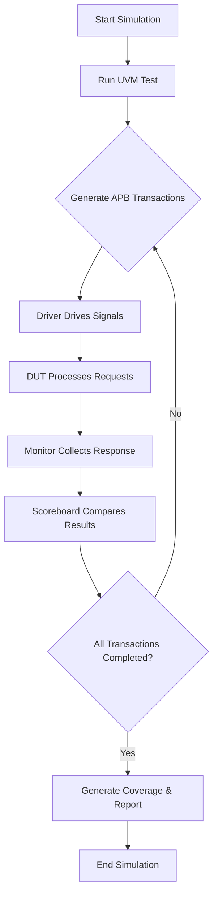

# UVM Verification of APB_RAM

## Overview
This project implements a comprehensive **UVM (Universal Verification Methodology)** environment to verify the functionality of an **APB_RAM** module. The APB_RAM module is a memory block interfaced with an **AMBA APB (Advanced Peripheral Bus)** protocol, supporting read and write operations with proper handshake and control signals.

---

## Project Description

The **APB_RAM** module serves as a synchronous memory block accessed through the APB protocol interface. It supports:
- Byte-addressable read/write operations
- Handshake signals including `PSEL`, `PENABLE`, and `PREADY`
- Error detection on protocol violations

The goal of this project is to develop a reusable, scalable UVM verification environment capable of thoroughly validating the APB_RAM design under multiple scenarios.

---

## Verification Environment Architecture

The verification environment is composed of the following components:

- **Agent**: Encapsulates Driver, Monitor, and Sequencer  
- **Driver**: Drives APB signals to the DUT according to sequences  
- **Monitor**: Observes DUT signals and collects transaction data  
- **Sequencer**: Generates sequences of APB transactions (read/write)  
- **Scoreboard**: Compares DUT outputs with expected results to ensure correctness  
- **Coverage Model**: Functional coverage points to verify stimulus completeness  

### Environment Block Diagram

  
*Figure 1: UVM Environment Block Diagram*

### APB Transaction Flowchart

  
*Figure 2: APB Read/Write Transaction Flow*

---

## Agent Configuration and UVM Package

To facilitate ease of use and scalability, the environment employs an **`agent_config`** configuration class that centralizes agent parameters and settings. This approach allows easy modification of agent behavior without changing multiple files.

Additionally, all UVM related classes and components are bundled inside a dedicated **package file (`uvm_apb_ram_pkg.sv`)**, which contains all the necessary UVM classes (driver, monitor, sequencer, agent, environment, scoreboard, coverage models). This packaging promotes modularity, reusability, and clean integration in different projects.

---

## Features

- Fully parameterized UVM agent for APB protocol  
- Multiple test scenarios including random and directed sequences  
- Automated scoreboard checking  
- Functional coverage collection with coverage reports  
- Error injection tests for protocol compliance  
- Support for debug and waveform generation  

---

## Getting Started

### Prerequisites
- UVM library (version 1.2 or higher)  
- SystemVerilog compliant simulator (e.g., Synopsys VCS, Mentor QuestaSim, Cadence Xcelium)  
- Bash shell or equivalent for running scripts  

### Setup Instructions
1. Clone the repository  
2. Compile the design and testbench files using the provided `compile.sh` script or equivalent command line  
3. Run simulation with the desired test scenario

```bash
./compile.sh
./run_sim.sh +UVM_TESTNAME=test_apb_random_write_read
```

---

## Simulation Flow

Below is a simplified flow of the simulation and verification process:



*Figure 3: Simulation Flowchart*

---

## Coverage and Reporting

- Functional coverage points track all valid read/write operations and address ranges  
- Scoreboard reports mismatches with detailed logs  
- Coverage reports generated in HTML format for easy analysis  
- Waveforms can be generated for debugging purposes  

---

## Tools and Requirements

| Tool           | Version              | Notes                                  |
|----------------|----------------------|----------------------------------------|
| Synopsys VCS   | 2023 or later        | Used for compilation and simulation    |
| UVM Library    | 1.2 or later         | Verification methodology framework      |
| Bash Shell     | Any POSIX-compliant   | For running scripts                     |

---

## References

- [UVM Reference Manual](https://verificationacademy.com/uvm)  
- [AMBA APB Protocol Specification (ARM)](https://developer.arm.com/documentation/ihi0022/latest)  
- [IEEE Standard for SystemVerilog](https://ieeexplore.ieee.org/document/9545505)  

---

## Author

**Your Name**  
Email: your.email@example.com  
LinkedIn: [Your LinkedIn Profile](https://www.linkedin.com/in/yourprofile)  

---

If you have any questions or need further assistance, feel free to contact me.
